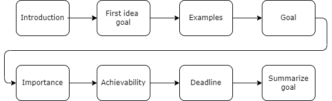

# Goal-setting dialogue for physical activity with a virtual coach
This github repository contains the code for the chatbot Jody that is created for the thesis project: Goal-setting dialogue for physical activity with a virtual coach. 
Please refer to our [OSF pre-registration](https://osf.io/4duwh/) for more details on our experiment.

## Dialog flow

The figure below visualizes the structure of the dialogue with Jody.

## System architecture

### Frontend
The frontend is a html-page that makes use of [Rasa Webchat](https://github.com/botfront/rasa-webchat) 1.0.1.

It is expected that the user ID is provided as a URL-parameter, e.g. http://<IP_address>:5005/?userid=beyza if the frontend is running on port 5005. This user ID is extracted and sent to the backend to link previous collected data to that user.

Files:
- index.html: html-page if the conversational agent runs locally.
- socketChannel.py: This file is needed to connect the frontend to the backend.

### Backend

The main component is a conversational agent trained in Rasa 2.8.0.

Files:
- actions: custom actions, e.g. to read from files.
- models: contains trained models.
- config.yml: configuration for the training of the agent.
- data: contains files to specify e.g. the stories on which the agent is trained.
- domain.yml: utterances, slots, forms etc.
- endpoints.yml: defines the endpoints of the conversational agent. 

### Experiment data

The experiment_data folder contains the following two files:
- goals.csv: contains the examples of people that achieved a running or walking goal.
- user_examples: this file contains example usernames that you can use to chat with Jody.

## Running Jody

To run the conversational agent locally:

1) Install the python package Rasa 2.8.0.
2) In a command window, navigate to the root folder and type `rasa run -m models --enable-api --cors  "*"`.
3) Open a separate command window and type `rasa run actions` to start the custom action server.
4) Open the frontend ("index.html") and specify a userid in the URL. Choose one of the usernames that can be found in /experiment_data/user_examples. For example: index.html?userid=beyza
5) Chat with the conversational agent.

## License

Copyright (C) 2022 Delft University of Technology.

Licensed under the Apache License, version 2.0. See LICENSE for details.
